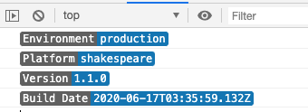
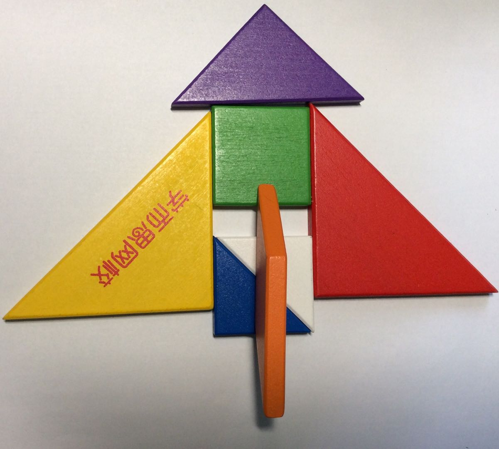

# BeautifulLog







```js
import BeautifulLog from "BeautifulLog";
var obj = {
  Environment: "production",
  Platform: "shakespeare",
  Version: "1.1.0",
  "Build Date": "2020-06-17T03:35:59.132Z",
};
var BLog = new BeautifulLog();
BLog.log(obj);
```
